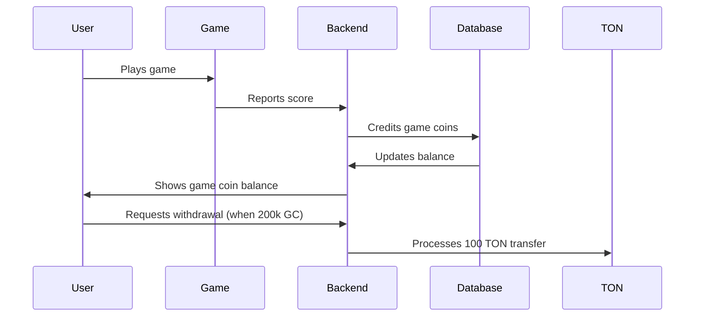

Prompt 2: i forgot to give you the structure!!!

Take a look at our telegram miniapp project structure and guide me on the changes and creations involving the files that need to be made.

i want us to make a change in our:

--> Rewarding logic: Users will be rewarded in game coins which can then be redeemed for ton coins. 200000 game coins = 100 TONS
--> Number of Levels and with catchy titles
--> Wallet Connection : Users should be able to connect their telegram wallet addresses to our miniapp directly enabling them to perform in-game purchases
--> Add in-game purchases for games like trivia for more questions, spin rounds, double & triple earnings in clicker, trex and egde-surf games which must also resonate with our premium memberships. Other purchases will include Game-coin booster purchases
--> Set maximum earning per day to 10Tons which is equal to 20000 game coins
--> Game resets per day to prevent misuse of the games = 3times

Based on your project structure, here's a comprehensive plan to implement your requirements while maintaining the existing architecture:

### 1. Reward System Conversion
**Files to Modify:**
1. `src/utils/conversions.py` (New conversion logic)
```python
GAME_COIN_TO_TON_RATE = 2000  # 200,000 GC = 100 TON
MAX_DAILY_GAME_COINS = 20000  # 10 TON equivalent

def game_coins_to_ton(coins):
    return coins / GAME_COIN_TO_TON_RATE

def calculate_reward(score, multiplier=1):
    raw_coins = score * 10 * multiplier
    return min(raw_coins, MAX_DAILY_GAME_COINS)
```

2. `src/features/balance_monitor.py` (Add daily limit tracking)
```python
def check_daily_limit(user_id):
    user = get_user(user_id)
    if user['daily_coins'] >= MAX_DAILY_GAME_COINS:
        raise Exception("Daily limit reached")
```

### 2. Game Levels System
**Files to Create/Modify:**
1. `src/games/levels.py` (New file)
```python
GAME_LEVELS = {
    'clicker': [
        {"title": "Novice Clicker", "threshold": 500},
        {"title": "Speedy Gonzales", "threshold": 2500},
        # 5 more levels...
    ],
    'trivia': [
        {"title": "Rookie Scholar", "threshold": 100},
        {"title": "Quiz Wizard", "threshold": 500},
        # 5 more levels...
    ]
    # Add for other games...
}
```

2. Update each game file (e.g. `clicker_game.py`, `trivia_quiz.py`) to include:
```python
from ..games.levels import GAME_LEVELS

class ClickerGame:
    def __init__(self):
        self.levels = GAME_LEVELS['clicker']
```

### 3. Wallet Connection
**Files to Modify:**
1. `src/integrations/telegram.py` (Add wallet connection)
```python
async def connect_wallet(update, context):
    wallet_address = update.message.text  # Get from Telegram MiniApp
    if validate_wallet(wallet_address):
        user = get_user(update.effective_user.id)
        user['wallet_address'] = wallet_address
        save_user(user)
        return "Wallet connected successfully!"
```

2. `src/telegram/miniapp.py` (Frontend integration)
```javascript
// Add to your MiniApp JS
function connectWallet() {
    Telegram.WebApp.sendData(JSON.stringify({
        type: 'connect_wallet',
        address: window.tonAddress
    }));
}
```

### 4. In-Game Purchases
**Files to Create/Modify:**
1. `src/features/monetization/premium.py` (Memberships)
```python
MEMBERSHIP_TIERS = {
    'BASIC': {'multiplier': 1},
    'PREMIUM': {
        'multiplier': 1.5,
        'perks': ['extra_questions', 'double_earnings']
    },
    'ULTIMATE': {
        'multiplier': 2,
        'perks': ['triple_earnings', 'unlimited_resets']
    }
}
```

2. `src/features/monetization/purchases.py` (New file)
```python
BOOSTERS = {
    'trivia_questions': {'id': 101, 'cost': 500},
    'double_earnings': {'id': 201, 'cost': 2000},
    # Other boosters...
}

def process_purchase(user_id, item_id):
    user = get_user(user_id)
    item = BOOSTERS[item_id]
    
    if user['game_coins'] >= item['cost']:
        user['game_coins'] -= item['cost']
        add_to_inventory(user_id, item)
        return True
    return False
```

### 5. Game Reset System
**Files to Modify:**
1. `src/integrations/task_limiter.py` (Add reset tracking)
```python
MAX_RESETS = 3

def check_reset_available(user_id, game_type):
    user = get_user(user_id)
    if user['daily_resets'].get(game_type, 0) >= MAX_RESETS:
        return False
    return True

def record_reset(user_id, game_type):
    user = get_user(user_id)
    user['daily_resets'][game_type] = user['daily_resets'].get(game_type, 0) + 1
    save_user(user)
```

### 6. Database Changes
1. `src/database/models.py` (Update User model)
```python
class User(BaseModel):
    wallet_address = CharField(null=True)
    game_coins = IntegerField(default=0)
    daily_coins_earned = IntegerField(default=0)
    daily_resets = JSONField(default={})
    inventory = JSONField(default=[])
    membership_tier = CharField(default='BASIC')
```

### Required Frontend Changes
1. `static/js/miniapp.js` (Add wallet UI)
```javascript
function updateCoinDisplay() {
    const tonValue = gameCoins / 2000;
    document.getElementById('coin-display').innerHTML = `
        ${gameCoins} GC (≈${tonValue.toFixed(2)} TON)
    `;
}
```

2. Each game's JS file (e.g. `static/clicker/clicker.js`):
```javascript
// Add reset handling
function handleReset() {
    fetch('/api/game/reset', {
        method: 'POST',
        body: JSON.stringify({game: 'clicker'})
    }).then(checkResetAvailability);
}
```

### Implementation Roadmap

1. **Backend Changes** (First Phase):
   - Update user model and database schema
   - Implement new reward calculation system
   - Create purchase processing system
   - Add wallet integration endpoints

2. **Frontend Changes** (Second Phase):
   - Add wallet connection UI
   - Implement coin display with TON conversion
   - Add purchase buttons to games
   - Create reset counters

3. **Game Modifications** (Third Phase):
   - Update each game to use new reward system
   - Add level progression displays
   - Implement booster effects

4. **Testing** (Final Phase):
   - Test wallet connections
   - Verify purchase flows
   - Validate daily limits and resets

### Critical Integration Points

1. **Telegram MiniApp Bridge**:
   ```python
   # In src/telegram/miniapp.py
   def handle_webapp_data(data):
       if data['type'] == 'wallet_connect':
           handle_wallet_connection(data['user_id'], data['address'])
   ```

2. **Daily Reset Cron**:
   ```python
   # In src/tasks/scheduled.py
   def reset_daily_limits():
       User.update_all(daily_coins_earned=0, daily_resets={})
   ```

3. **Game Reward Endpoint**:
   ```python
   # In src/web/routes.py
   @app.route('/api/reward', methods=['POST'])
   def reward():
       user = get_authenticated_user()
       coins = calculate_reward(request.json['score'])
       if user.daily_coins_earned + coins > MAX_DAILY_GAME_COINS:
           return error_response("Daily limit reached")
       user.update(coins_earned=F('coins_earned') + coins)
       return success_response()
   ```

Would you like me to provide:
1. Complete sample implementations for any specific game?
2. Detailed database migration scripts?
3. Specific Telegram MiniApp UI components?
4. Security audit recommendations for the new systems?


Prompt 2: With this update, i assume we no longer need to connect to ton servers since users are getting rewaarded in game coins for now until they hit the withdrawal thresh hold


You're absolutely right. With the new game coins system, we can simplify the architecture by deferring TON network interactions until withdrawal time. Here's how we'll adjust the implementation:

### 1. Removal of Unnecessary TON Integrations

**Files to Deprecate/Modify:**
1. `src/integrations/ton.py` → Keep only withdrawal functions
```python
# Only maintain this function, remove others
async def process_withdrawal(wallet_address, amount_ton):
    # Existing TON transfer logic
```

2. `src/integrations/tonclient.py` → Reduce to minimal
```python
class TonClient:
    async def send_ton(self, wallet_address, amount):
        # Keep only this essential method
```

### 2. Simplified Reward Flow

**New Internal Economy Flow:**


### 3. Key Modifications to Existing Systems

1. **Reward Processing** (`src/features/balance_monitor.py`):
```python
def credit_game_coins(user_id, coins):
    if not check_daily_limit(user_id):
        raise DailyLimitExceeded()
    
    user = get_user(user_id)
    new_balance = user['game_coins'] + coins
    User.update(game_coins=new_balance).where(User.id == user_id)
```

2. **Withdrawal System** (`src/integrations/withdrawal.py`):
```python
MIN_WITHDRAWAL = 200000  # 200k GC = 100 TON

def request_withdrawal(user_id):
    user = get_user(user_id)
    if user['game_coins'] < MIN_WITHDRAWAL:
        raise InsufficientBalance()
    
    ton_amount = user['game_coins'] / 2000
    ton_client.send_ton(user['wallet_address'], ton_amount)
    
    User.update(game_coins=F('game_coins') - MIN_WITHDRAWAL)
```

### 4. Frontend Simplifications

1. Remove real-time TON balance displays (`static/js/miniapp.js`):
```javascript
// Before: 
// showBothBalances(gameCoins, tonBalance);

// After:
showGameCoinBalance(gameCoins);
```

2. Update withdrawal UI (`templates/user/withdrawal.html`):
```html
<!-- Change from instant TON rewards to withdrawal system -->
<div class="withdrawal-panel">
    <p>Current Balance: <span id="game-coins">{{ user.game_coins }}</span> GC</p>
    <button id="withdraw-btn" 
            data-min="200000"
            disabled="{{ user.game_coins < 200000 }}">
        Withdraw 100 TON (200,000 GC)
    </button>
</div>
```

### 5. Security Adjustments

1. Remove real-time TON validations (`src/security/anti_cheat.py`):
```python
# Before: 
# def validate_ton_transaction(tx_hash):

# After: Focus only on game coin validation
def validate_game_coin_earning(user_id, claimed_score):
    # Implement score validation logic
```

### 6. Database Optimization

Remove unnecessary TON-related fields from `src/database/models.py`:
```python
# Before:
# class User:
#     ton_balance = FloatField()
#     pending_ton = FloatField()

# After:
class User:
    game_coins = IntegerField(default=0)
    # Keep only wallet_address for withdrawals
    wallet_address = CharField(null=True) 
```

### Implementation Benefits

1. **Reduced Complexity**:
   - No need for real-time TON balance checks
   - Fewer API calls to TON blockchain
   - Simplified transaction tracking

2. **Improved Performance**:
   - Game rewards become database operations only
   - No blockchain wait times during gameplay
   - Batch withdrawals reduce gas fees

3. **Enhanced Security**:
   - Fewer attack vectors (no live wallet interactions during play)
   - Cheaper anti-cheat (validate game coins instead of TON tx)

### Migration Strategy

1. **Phase 1**: 
   - Implement game coins system
   - Disable direct TON rewards
   - Add withdrawal threshold UI

2. **Phase 2**:
   - Migrate existing user balances:
     ```python
     # Migration script in src/utils/upgrade_manager.py
     def migrate_to_game_coins():
         for user in User.select():
             user.game_coins = user.ton_balance * 2000
             user.save()
     ```

3. **Phase 3**:
   - Remove deprecated TON integration code
   - Update documentation

Would you like me to provide:
1. Detailed withdrawal processing flow?
2. Game coin balance migration script?
3. Updated API documentation samples?
4. Security considerations for the new system?